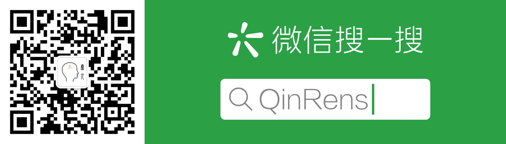

# Qinren Standard

This repo contains the code, documents, project standard for QinRen group.

## 1. Code
+ Code style
+ Code document

### 1.1 [Python](code/python/README.md)
### 1.2 [MATLAB](code/matlab/README.md)
### 1.3 [Shell](code/matlab/REAMDE.md)

## 2. Project Management
+ Project Structure
+ Project document

### 2.1 Python
### 2.2 MATLAB
### 2.3 Simulink
### 2.4 Flask, html / CSS / JavaScript
### 2.5 Spark

## 3. Team Work
### 3.1 Git flow
### 3.2 Meetings

## 4. Others
### 4.1 Linux
### 4.2 QinRen Webpage / WeChat / GitHub / Email

- - -

## Welcome to subscribe us!

+ Main page:

    http://qinren.tech/

+ Wechat:

## Welcome to join us!

+ Recuitment:

    http://qinren.tech/recuitment/index.html

## Welcome to contact us!

+ E-mail:

    qinren_tech@163.com

